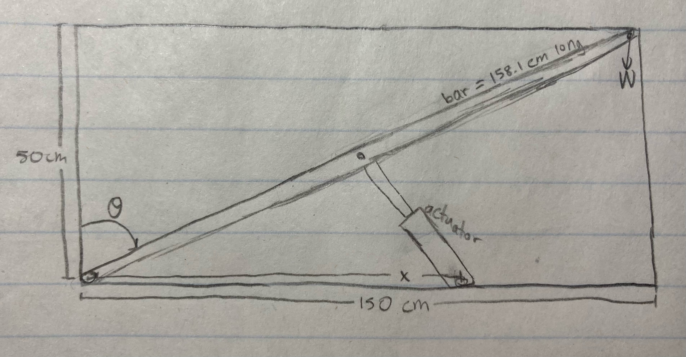

As part of a class assignment, I was asked to design a mechanism that lifts the maximum possible weight to the maximum possible height, keeping in mind certain parameters. This optimization problem applied what I've learned about frames and mechanisms.

We were given a design space 150 cm long by 50 cm tall, a rigid bar of any length, 3 pin supports (2 needed to be mounted to the ground), and a linear actuator chosen from a catalog.

This is how I solved the problem:

Step 1 (edited):

Set-up: I picked the RSX high force rod-style actuator, because it had the largest max force and stroke length of those available (up to 294 kN and a stroke length of up to 150 cm). I will place two of the pins mounted to the ground and attach the bar to one of them and the actuator to the other. The bar spans the hypotenuse of the design space (158.11 cm long). The actuator will be pinned to the ground at some relatively large distance x = close to 150 cm away so that its moment arm is increased and it can lift a larger weight, although some height will be sacrificed.

Assumptions: Bar is rigid, weight attached is a point mass

Calculations: To be able to apply the greatest moment, the linear actuator should start perpendicular to the bar. As the linear actuator extends, it will apply a smaller moment on the bar, and so will the weight, until the linear actuator fully extends. See image: 

Conclusions: I chose to use somewhere between Case 1 and Case 2 in my design to strike a balance between maximum height reached and maximum weight lifted. 

